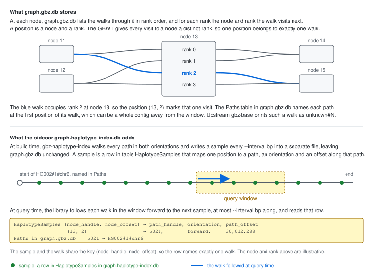
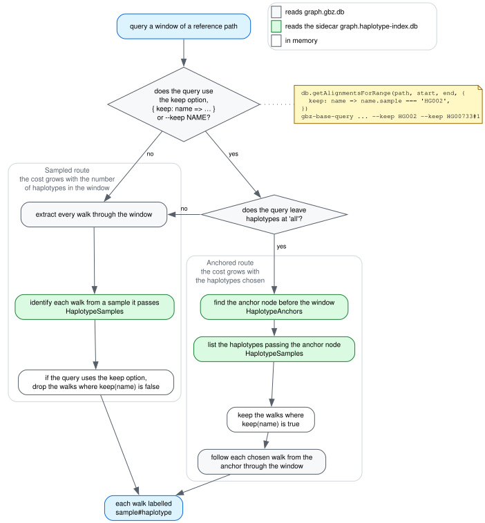

# The haplotype index

Upstream gbz-base prints each walk other than the query path as `unknown#N`.
This package reports the sample, haplotype and contig of every walk, looked up
in a haplotype index: a sidecar SQLite file that the Rust program
`gbz-haplotype-index` writes beside the graph database. The graph database stays
as `gbz-base construct` wrote it, so a haplotype index also works with a
database someone else hosts.

Two things happen at different times. Building the haplotype index happens once
per graph, and the file covers every haplotype in the graph. Identifying walks
happens on every query that reads the index. A caller who wants a subset of the
haplotypes passes the `keep` option with the query
([below](#querying-a-subset-of-the-haplotypes)); the index needs no rebuild for
a different choice.

## Samples and anchors

A path is one contig of one haplotype, named `sample#haplotype#contig`. The GBWT
stores each path as a walk, a sequence of positions. A position is a node plus
the rank of one walk among the walks through that node, so each position belongs
to exactly one walk. The GBWT maps each position to the next one, and identifies
a path at the start of its walk, which can be a whole chromosome away from a
query window. The haplotype index records the path at positions along the way:

- A **sample** records a position, the path through it, the orientation and the
  coordinate along that path. `gbz-haplotype-index` writes one every
  `--interval` bp along each path, in both orientations, plus one at the start
  and end of each path. To identify a walk, the library follows the walk to the
  nearest sample. A larger interval gives a smaller index and longer walks, the
  same trade as the sampled suffix array in an FM-index.
- An **anchor** is a reference node that most haplotypes in the region visit,
  one every `--anchor-spacing` bp along each reference path. The haplotype index
  contains a sample for every visit to an anchor node, so the samples at that
  node list every haplotype passing it, with the position and coordinate of each
  visit.



A query that uses the `keep` option reads the samples in the window and the
anchor rows on both sides of it. `gbz-haplotype-index` starts the interval count
of each path again at every anchor visit, so the samples of all haplotypes fall
near the same reference positions, and a window shorter than `--interval` often
contains none. The anchor rows before and after the window list the position and
coordinate of each chosen haplotype on both sides, and the query walks each
chosen haplotype from one to the other ([below](#keep)).

Table `HaplotypeSamples` contains the samples, `HaplotypeAnchors` lists the
anchor nodes, and `HaplotypeLengths` lists the length of each path.

The word "sample" also means an individual, such as `HG002` in a path name. The
rest of this page uses it for the index entry.

## Building the haplotype index

```bash
cargo install gbz-haplotype-index

gbz-haplotype-index --interval 16384 --anchor-sample GRCh38 graph.gbz graph.haplotype-index.db

# without the GBZ, reading paths from the database
gbz-haplotype-index --interval 16384 --anchor-sample GRCh38 --from-db graph.gbz.db graph.haplotype-index.db
```

Give `graph.gbz.db` before the index path to check that it matches the GBZ, and
`--overwrite` to replace an existing index. `--anchor-spacing` defaults to
32,768 bp, and `--anchor-sample` places the anchors on the paths of one
reference sample. Anchoring both GRCh38 and CHM13 in the HPRC chr22 graph
doubled the anchor rows, and a query on a path with no anchor near the window
identifies every walk. `--anchor-spacing 0` writes no anchors. The source is in
`tools/haplotype-index/`.

Keep the default of sampling both orientations. `open` rejects an index built
with `--forward-only`, because about half the contigs in a graph like HPRC's run
reversed relative to the reference, and identifying a walk on one of those needs
reverse-orientation samples.

For the 10 GB HPRC v2.1 GRCh38 database, the index with 131,072 bp anchors on
GRCh38 and CHM13 is 7.9 GB, and building it from the GBZ takes 13 minutes on 24
cores and peaks at 12 GB of memory. On the HPRC chr22 graph, 32,768 bp anchors
on GRCh38 alone made the index 5.6% larger than that setting.

## Using the haplotype index

```ts
const db = await GBZBase.open(new RemoteFile(graphUrl), {
  haplotypeIndex: new RemoteFile(indexUrl),
})
```

```bash
gbz-base-query https://host/graph.gbz.db \
  --haplotype-index https://host/graph.haplotype-index.db ...
```

`open` checks the path and node counts recorded in the haplotype index against
the graph.

## Querying a subset of the haplotypes

A query returns every haplotype that passes through the window, 464 in each HPRC
window we measured. To get a few of them, such as the two haplotypes of HG002,
pass `keep` with the query:

```ts
const records = await db.getAlignmentsForRange('GRCh38#0#chr6', start, end, {
  keep: name => name.sample === 'HG002',
})
```

```bash
gbz-base-query ... --keep HG002 --keep HG00733#1
```

The query then returns the reference, the haplotypes you kept and the nodes they
visit: the walks the same query without `keep` returns for those haplotypes.
`--keep` takes a sample or `sample#haplotype` and can repeat. A query that uses
the `keep` option needs the haplotype index, because the library looks up the
haplotype of each walk in it.

## How a query identifies walks

The library identifies walks by one of two routes, and both return the same
walks with the same GBWT positions and coordinates. The tests compare the two
routes record for record, and check each record by walking back through the GBWT
to a sample of its path.


- **Sampled**: the query extracts every walk through the window, then follows
  each walk to a sample to identify it. The cost grows with the number of
  haplotypes in the window.
- **Keep**: the query builds the same subgraph and finds the walks of the chosen
  haplotypes in it from the samples and the anchor rows. The cost grows with the
  number of haplotypes chosen.

A query that uses the `keep` option takes the keep route when `haplotypes` is
`'all'`, the default, and the haplotype index has anchors. The keep route
returns its walks when the haplotype index places every haplotype it sees at the
anchors or in the window ([below](#keep)); a chosen haplotype with no visit to
any anchor read and no sample in the window stays out of the result. When a
check fails, the library identifies every walk on the same subgraph, then drops
the haplotypes the predicate rejects.



The flowchart source is [naming-routes.dot](img/naming-routes.dot); the
schematic is hand-written SVG.

### Sampled

1. The query extracts every walk through the nodes in the window.
2. `identifyPaths()` identifies each walk from a sample the walk passes inside
   the window. A walk with no sample there is followed past the window, for
   about four sampling intervals, and printed as `unknown#N` if that finds none.
3. For a query that uses the `keep` option, the library then drops the
   haplotypes the predicate rejects.

### Keep

1. The query builds the subgraph as the sampled route does, from the reference
   walk through the window, `context` bp around it and the snarls that `snarls`
   selects. A piece of a walk is a run of its positions whose nodes all lie in
   this subgraph.
2. The query reads the rows at the anchor before the window and the anchor after
   it. Each row gives the path, position and coordinate of one visit, and the
   visits place each path. A path with a visit on each side lies between them. A
   path with a visit on one side ends between the anchors or bypasses the other
   anchor node, and can lie up to the distance between the anchors from its
   visit. The query also reads the next two anchors out on each side, so a path
   that bypasses both near anchor nodes is placed from a wider visit, and a
   visit on one side can pair one on the other. A path with a sample on the
   subgraph's nodes and no visit to any of these anchors counts as local when it
   is shorter than the stretch between the outermost anchors, plus 64 kb.
3. The query reads the samples on the nodes of the subgraph and checks that each
   one lies within 32 kb of where its path can lie.
4. The query walks each chosen haplotype from its visit to the anchor before the
   window to its visit to the anchor after it, and on to 32 kb past the last
   piece it finds, and records every piece on the way. A haplotype that passes
   one anchor on the flipped handle carries an inversion covering that anchor,
   and traverses the stretch between the anchors backward from there, so the
   walk goes on through that stretch, and each walk also goes back 32 kb before
   the first piece it found. A haplotype with a visit on one side is walked from
   the row that heads into the window through the stretch to where the other
   anchor would be, and that walk counts when the contig ends on the way. A
   chosen haplotype with no visit and a sample in the subgraph is walked whole
   from its start. A chosen haplotype with no visit to any of the anchors read
   and no sample in the subgraph is invisible to the route, and its pass stays
   out of the result.
5. `extractPaths` keeps each piece in the orientation whose end nodes are
   canonical. When the walk found a piece in the other orientation, the query
   walks on in that orientation and reads the samples of the other orientation
   at each node until one matches the coordinate, then walks from that sample
   into the piece.

The checks fail when an anchor is missing, when a chosen haplotype has no visit
a walk can start from, when a path with a sample in the subgraph and no visit is
too long to lie between the anchors, when a sample in step 3 lies outside where
its path can lie, when a walk in step 4 reaches its cap or a one-sided walk runs
on past the stretch without the contig ending, or when a twin in step 5 stays
out of reach. The query then identifies every walk on the same subgraph and
drops the haplotypes the predicate rejects. A sample outside where its path can
lie comes from a segmental duplication or a collapsed paralog, where a haplotype
crosses the window's nodes again hundreds of kb away: 130-270 kb away at IGL on
HPRC chr22. At AMY1 in HPRC v2.1, one contig starts inside the window and passes
the stretch between the anchors again 500 kb later, in reverse. The query also
identifies every walk when more than 32 chosen paths pass the anchors, because
the sampled route took less time than the walks for 42 haplotypes.
`gbz-base-query --stats` prints the reason.

On HPRC chr22, over 58 windows at `context` 0 and 1000 with five keep sets, the
keep route answered 494 of 580 queries with anchors every 131,072 bp and 491
with anchors every 32,768 bp, and matched the sampled route's walks in each. The
other queries, all in LCR22, IGL and GSTT, went to the sampled route. With the
pages cached, the keep route's median was 121 ms and 81 ms on the two indexes,
against 787 ms and 767 ms for the sampled route
([performance.md](performance.md#a-subset-of-the-haplotypes)).
