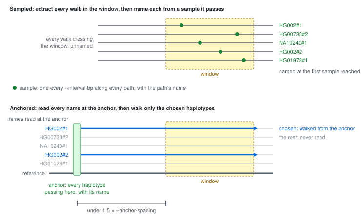

# The haplotype index

Upstream gbz-base prints each walk other than the query path as `unknown#N`.
This package reports the sample, haplotype and contig of every walk, looked up
in a haplotype index: a sidecar SQLite file that the Rust program
`gbz-haplotype-index` writes beside the graph database. The graph database stays
as `gbz-base construct` wrote it, so an index also works with a database someone
else hosts.

## Samples and anchors

A path is one contig of one haplotype, named `sample#haplotype#contig`. The GBWT
stores each path as a walk, a sequence of positions: a node, plus the rank of
this walk among the walks through that node. The GBWT maps each position to the
next one, and identifies a path at the start of its walk, which can be a whole
chromosome away from a query window. The haplotype index records the path at
positions along the way:

- A **sample** is a position with its path, orientation and coordinate.
  `gbz-haplotype-index` writes one every `--interval` bp along each path, in
  both orientations, plus one at each path's start and end. To identify a walk,
  a query follows it to the nearest sample. A larger interval gives a smaller
  index and longer walks, the same trade as the sampled suffix array in an
  FM-index.
- An **anchor** is a reference node that most haplotypes in the region visit,
  one every `--anchor-spacing` bp along each reference path. The index contains
  a sample for every visit to an anchor node, so the samples at that node list
  every haplotype passing it.

Table `HaplotypeSamples` contains the samples, `HaplotypeAnchors` lists the
anchor nodes, and `HaplotypeLengths` lists the length of each path.

The word "sample" also means an individual, such as `HG002` in a path name. The
rest of this page uses it for the index entry.

## Building the index

```bash
cargo install gbz-haplotype-index

gbz-haplotype-index --interval 16384 --anchor-spacing 131072 graph.gbz graph.haplotype-index.db

# without the GBZ, reading paths from the database
gbz-haplotype-index --interval 16384 --anchor-spacing 131072 --from-db graph.gbz.db graph.haplotype-index.db
```

Give `graph.gbz.db` before the index path to check that it matches the GBZ, and
`--overwrite` to replace an existing index. The source is in
`tools/haplotype-index/`.

Keep the default of sampling both orientations. `open` rejects an index built
with `--forward-only`, because about half the contigs in a graph like HPRC's run
reversed relative to the reference, and identifying a walk on one of those needs
reverse-orientation samples.

For the 10 GB HPRC v2.1 GRCh38 database, the index is 7.9 GB. Building it from
the GBZ takes 13 minutes on 24 cores and peaks at 12 GB of memory.

## Using the index

```ts
const db = await GBZBase.open(new RemoteFile(graphUrl), {
  haplotypeIndex: new RemoteFile(indexUrl),
})
```

```bash
gbz-base-query https://host/graph.gbz.db \
  --haplotype-index https://host/graph.haplotype-index.db ...
```

`open` checks the path and node counts recorded in the index against the graph.

## Keeping a set of haplotypes

A query returns every haplotype that passes through the window, 464 in each HPRC
window we measured. To get a few of them, such as the two haplotypes of HG002,
list them with the `keep` option:

```ts
const records = await db.getAlignmentsForRange('GRCh38#0#chr6', start, end, {
  keep: name => name.sample === 'HG002',
})
```

```bash
gbz-base-query ... --keep HG002 --keep HG00733#1
```

The query then returns the reference, the chosen haplotypes and the nodes they
visit. `--keep` takes a sample or `sample#haplotype` and can repeat. `keep`
needs the haplotype index to find the haplotype of each walk.

## How a query identifies walks

A query identifies walks by one of two routes, and picks the route itself. Both
routes find the same haplotype for every walk. The tests compare the two, and
check each result by walking back through the GBWT to the path's start.



- **Sampled**: extract every walk in the window, then identify each from a
  sample it passes. The cost grows with every haplotype in the window.
- **Anchored**: read which haplotypes pass the anchor before the window, then
  follow the chosen ones. The cost grows with the number chosen.

A windowed query with `keep` takes the anchored route when the index has anchors
and `haplotypes` is `all`, the default. Every other query takes the sampled
route.


The flowchart source is [naming-routes.dot](img/naming-routes.dot); the
schematic is hand-written SVG.

### Sampled

1. The query extracts every walk crossing the window's nodes, none yet
   identified.
2. `identifyPaths()` identifies each walk from a sample on its positions in the
   window. It follows a walk with no sample there past the window, for about
   four sampling intervals, and prints the walk as `unknown#N` if it meets none.
3. With `keep`, the query then drops every other haplotype.

### Anchored

1. The query looks up the anchor for the last multiple of `--anchor-spacing` at
   or before the window's start. That node lies under 1.5 spacings before the
   window, and the query walks the reference from it to the window.
2. It reads the samples at the anchor node and takes those of the chosen
   haplotypes.
3. It follows each chosen walk forward through the window, already identified.
4. A chosen haplotype with no sample at the anchor, because its contig starts
   after the anchor or its walk bypasses the node, may have a sample on one of
   the window's reference nodes. The query walks back from that sample to where
   the haplotype enters, then forward as in step 3.
5. If a walk never reaches the window, for example because its contig ends
   first, or a haplotype in step 4 has no such sample, the query redoes the
   window by the sampled route. `gbz-base-query --stats` prints the reason.

With the pages cached, 8 HPRC haplotypes take 0.4-1 s by this route, against 2-9
s for the sampled query of all 464
([performance.md](performance.md#keeping-a-set-of-haplotypes)).
